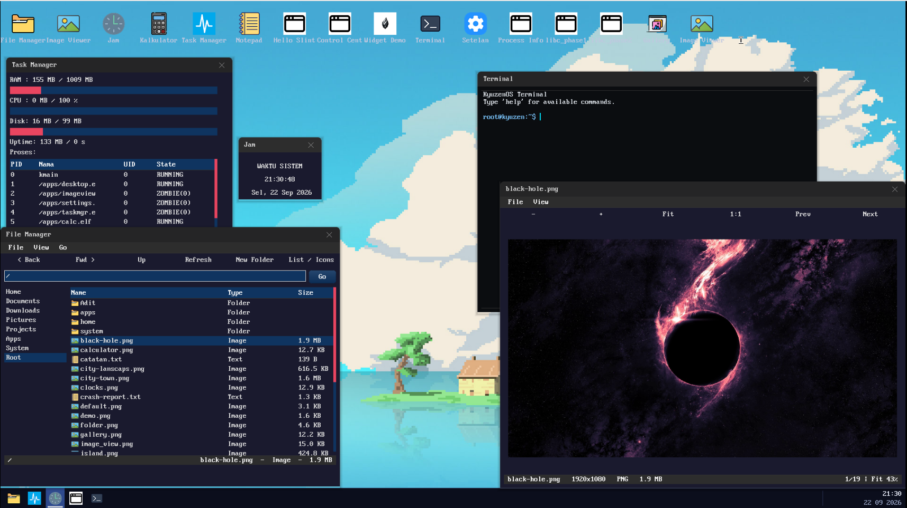

<div align="center">
  

  # Kyuzen OS

  **A 64-bit Higher-Half Operating System Built from Scratch - with a real GUI, SMP, and protected user space**

  
  
  
  
  
  
  

  

  <i>Concurrent GUI apps (spawned as independent Ring-3 tasks) over a composited desktop - Calculator &amp; File Manager side by side.</i>
</div>

---

## Table of Contents
- [About](#about)
- [Feature Highlights](#feature-highlights)
- [Bundled Applications](#bundled-applications)
- [SDK](#sdk)
- [Getting Started](#getting-started)
- [First Boot](#first-boot)
- [Testing & Debugging](#testing--debugging)
- [Directory Structure](#directory-structure)
- [Documentation](#documentation)
- [Roadmap Status](#roadmap-status)
- [License](#license)

## About

Kyuzen OS is a monolithic operating system written from scratch in C, C++, and Rust — no standard library, no starter code. It boots on bare metal (BIOS & UEFI) into a higher-half 64-bit kernel with preemptive multi-core scheduling, memory-protected Ring-3 applications, a composited window manager, its own filesystem, and a TCP/IP stack.

Everything on screen — every pixel, window, and keystroke — is produced by code in this repository.

## Feature Highlights

<table>
<tr>
<td width="50%" valign="top">

### Kernel & CPU
- 64-bit higher-half kernel (`0xFFFFFFFF80000000+`), Limine boot protocol (BIOS + UEFI hybrid ISO)
- **SMP**: multi-core boot via LAPIC, per-CPU run queues with **work stealing**, priorities + anti-starvation aging
- **Preemptive scheduler** with full-ISR-frame context switch; per-task kernel stacks (**RSP0 follows task**)
- Sleep queues, wait queues, mutex / semaphore / condition variable

### Protection & Isolation
- **Ring-3 user space** with per-process address spaces (PML4 per app)
- **SMAP / SMEP + WP** enforcement; all user pointers validated & copied through a boundary layer (`copy_to_user` / `copy_from_user`)
- Per-process user heap; per-address-space cookies
- `badptr` self-test app that probes the isolation boundaries

</td>
<td width="50%" valign="top">

### Display & GUI
- Framebuffer graphics primitives on a **DisplayBuffer / Viewport** abstraction
- **Compositor**: dirty-region tracking + double buffering (no flicker, cheap repaints)
- **KWM window manager**: drag, z-order, per-task window ownership
- **Widget toolkit** (`libs/widget/`): layered architecture — core/primitives/layout/containers/chrome/dialog/window
- **libdesktop**: high-level C++ desktop SDK (Application, Window Manager, Canvas, Events)
- Intel integrated GPU driver + VirtIO virtual GPU support

### Input & Devices
- PS/2 **keyboard**: full key down/up events, modifiers (Shift/Ctrl/Alt/CapsLock), extended `E0` scancodes
- PS/2 **mouse** with IntelliMouse scroll wheel
- Interrupt-driven event queue (ISR push → syscall pop)
- ATA PIO storage, RTC, serial, PCI, PIT/LAPIC timer (60/100/144 Hz refresh)

### Storage & Networking
- **KyuzenFS V4**: extent-based filesystem with 4KB block cache (LRU), POSIX-ish fd API (`open/read/write/lseek/close`)
- Path-aware with real folders (`mkdir`, nested paths; folder = flagged directory entry)
- Host-side format tool: `make mkfs && ./mkfs.kyuzenfs disk.img`
- **lwIP TCP/IP** on an Intel e1000 NIC: DHCP, DNS, ICMP **ping**, TCP client sockets

</td>
</tr>
</table>

## Bundled Applications

| App | Description |
| --- | --- |
| `shell` | Login shell with 25+ commands (`help`, `ls`, `zen`, `start`, `sched`, `ping`, …) |
| `desktop` | Desktop environment with app launcher, taskbar, wallpaper, crash notification |
| `fileman` | File manager for KyuzenFS |
| `viewer` | Image Viewer: PNG gallery (sidebar), auto-fit to window, zoom + scrollbars on demand (stb_image) |
| `terminal` | Terminal emulator (TextEdit-based) |
| `notepad` | Text editor with undo/redo, find/replace, word wrap |
| `clock` | Real-time clock widget |
| `calc` | Calculator |
| `taskmgr` | Task / system monitor |
| `settings` | System settings |
| `procinfo` | Process information viewer |
| `widget_demo` | Widget toolkit showcase |
| `badptr` | Ring-3 isolation self-test |

App binaries ship as `.elf` files (plus optional `<name>.app` manifests) stored under **`/apps/`** on the KyuzenFS disk. The desktop launcher scans `/apps`, and the ELF loader resolves bare names — `clock`, `start calc` — to `/apps/<name>.elf` automatically. User data (`*.txt`, `*.png`, `users.sys`) stays at the root.

<details>
<summary><b>Shell quick tour (click to expand)</b></summary>

```text
root@kyuzen> help            # list every command
root@kyuzen> ls              # KyuzenFS listing
root@kyuzen> zen notes.txt   # text editor
root@kyuzen> start clock     # spawn a CONCURRENT GUI app (new Ring-3 task)
root@kyuzen> sched           # scheduler/CPU dump (tasks, per-CPU map)
root@kyuzen> fetch           # neofetch-style system info
root@kyuzen> ping 8.8.8.8    # ICMP echo over lwIP
root@kyuzen> nettest 10.0.2.2 7777   # TCP socket test
root@kyuzen> refresh 144     # set display refresh rate
```

Typing any app name (`clock`, `calc`, `fileman`…) execs it in place;
`start <app>` spawns it **concurrently** - the shell keeps running.
</details>

## SDK

Kyuzen OS provides a C and C++ SDK for building userspace applications:

### C SDK (`sdk/c/`)
- Full LLVM libc (stdio, stdlib, string, math, …)
- CRT entry point (`crt.o`) + linker script (`app.ld`)
- Headers staged to `build/sdk/c/include/`

### C++ SDK (`sdk/cpp/`)
- libc++ subset (string, vector, algorithm, memory, type_traits, …)
- C++ runtime (`cxxrt.o` — `operator new/delete`, `__cxa_pure_virtual`, guards)
- `kyuzen-c++` wrapper compiler script
- **libdesktop** — high-level desktop C++ library:
  - `Application` — event loop + window lifecycle
  - `WindowManager` — window creation, z-order, focus
  - `Canvas` — drawing surface abstraction
  - `Event` — input/window/system event types
  - `System` — desktop service queries

### Rust SDK (`rust/`)
- `no_std` userspace with custom allocator
- `kyuzen-sys` — raw syscall bindings
- `kyuzen-gui` — Slint-based GUI framework
- Built with `cargo build --release`

Build all: `make apps` (C + C++ user apps + libdesktop + desktop)

## Getting Started

### Prerequisites
- **Clang/LLVM** (`clang`, `ld.lld`)
- **NASM**
- **GNU Make**
- **xorriso** (hybrid ISO)
- **QEMU** (`qemu-system-x86_64`)
- **CMake** (for LLVM libc build)
- **Rust toolchain** (for Rust apps, optional)

### Build & Run
```bash
make                # 1. compile kernel → build/bin/myos.bin
make apps           # 2. compile SDK + user apps → build/apps/*.elf
make boot_image.iso # 3. package hybrid BIOS+UEFI ISO → build/boot_image.iso
make run            # 4. boot in QEMU (-cpu max -m 1G -smp 8, virtio-vga)
```

<details>
<summary><b>All build targets (click to expand)</b></summary>

| Target | Purpose |
| --- | --- |
| `make` / `make all` | Compile kernel (`build/bin/myos.bin`) |
| `make apps` | Compile SDK (C & C++) + libdesktop + user apps + desktop |
| `make desktop` | Build desktop.elf only |
| `make rust-apps` | Compile Rust userspace apps |
| `make boot_image.iso` | Kernel + apps + Rust + Limine → bootable ISO |
| `make run` | Build & boot QEMU with virtio-vga (1920×1080) |
| `make run FULLSCREEN=0` | Windowed mode |
| `make run QEMU_DISPLAY=none FULLSCREEN=0` | Headless (serial.log only) |
| `make mkfs` | Host-side KyuzenFS V4 format tool |
| `make sdk-c` | Stage C SDK only |
| `make sdk-cpp` | Stage C++ SDK + libdesktop only |
| `make stress` | PMM stress test build + run |
| `make conc` | Concurrency test build + run (mutex/sem/condvar) |
| `make heap-stress` | Heap overflow/canary detection build |
| `make heap-watch` | Heap watch debug build (serial logging) |
| `make clean` / `make clean-apps` / `make clean-tool` | Remove build output |
| `make compile_commands` | Regenerate IntelliSense database |
</details>

## First Boot

On a fresh disk, Kyuzen runs a one-time setup asking you to **create the root password** (stored in `users.sys`). Afterwards you land on the login screen; logging in drops you into the shell.

Default credentials: **root** / **1**

## Testing & Debugging

### Kernel tests (run inside QEMU)
- **`make conc`** - sleep/wait-queue/mutex/semaphore/priority test suite (`-smp 4`)
- **`make stress`** - physical memory manager stress
- **`make heap-stress` / `make heap-watch`** - heap canary + watchpoint corruption hunting
- **`badptr`** user app - attacks the Ring-3 boundary (null/unmapped pointers, invalid syscall args)

### Host-side tests (run on host, no QEMU)
- **`make test-kyuzenfs-v4`** - FS engine: format/CRUD/extent/LRU/remount (RAM-mocked ATA)
- **`make test-kyuzenfs-xcheck`** - disk image from `./mkfs.kyuzenfs` must mount in kernel
- **`make test-panic`** - BSOD: diagnostics, lockdown, keys R/S, log RAM, crashdump disk, ACPI FADT
- **`make test-desktop`** - desktop manifest discovery + crash notification lifecycle
- **`make test-libc-heap`** - heap allocator host tests
- **`make test-textedit`** - editor widget: undo/redo, selection, find/replace, word wrap arithmetic

### Debug
- **BOSD** (Blue Screen of Death) exception screen with full register dump, CR2, task & CPU context
- **Crash report** published as `/crash-report.txt` on next boot (readable from File Manager)
- **Desktop notification** for fresh crashes (card in top-right corner, opens File Manager)
- `make run-wd` / `make run-serial` - serial debug output

## Directory Structure

| Directory | Main Function |
| --- | --- |
| `arch/x86/` | Architecture code: GDT/TSS, IDT, ISR/LAPIC/SMP entry (ASM) |
| `kernel/` | Core: PMM, VMM/paging, heap, ELF loader, syscalls, event queue |
| `kernel/sched/` | Scheduler: run queues, lifecycle, blocking/sleep |
| `kernel/smp/` | Multi-core bring-up |
| `kernel/gfx/` | Compositor, KWM window manager, framebuffer |
| `kernel/fs/` | KyuzenFS V4: superblock, inode, extents, dirs, vnode, block cache |
| `kernel/panic/` | BSOD module (orchestrator, draw, hw, explain) |
| `kernel/net/` | lwIP glue layer |
| `drivers/` | ATA, keyboard, mouse, PCI, RTC, serial, timer, TTY |
| `drivers/net/` | e1000 NIC driver + lwIP port |
| `drivers/graphics/` | Intel integrated GPU, VirtIO virtual GPU |
| `graphics/` | Display abstraction, backend, memory management |
| `fs/` | VFS abstraction + fd layer |
| `apps/` | Kernel-side apps (shell, login, desktop) & libgui/userlib shims |
| `user_apps/` | Ring-3 ELF applications (fileman, clock, calc, terminal, …) |
| `libs/widget/` | Widget toolkit: layered (core → primitives → layout → containers → window) |
| `libs/libdesktop/` | High-level C++ desktop library (Application, WindowManager, Canvas, Events) |
| `libs/color/` | Shared color library: RGBA, blending, HSL/HSV, UI utilities |
| `libs/libc-port/` | LLVM libc port layer + C++ runtime |
| `sdk/c/` | C SDK: LLVM libc + CRT + linker script |
| `sdk/cpp/` | C++ SDK: libc++ subset + kyuzen-c++ wrapper + app linker |
| `rust/` | Rust userspace: kyuzen-sys (syscall bindings), kyuzen-gui (Slint) |
| `third_party/net/lwip/` | lwIP TCP/IP stack (vendored) |
| `third_party/stdlib/` | LLVM libc + libc++ sources |
| `tools/` | Host tools (mkfs.kyuzenfs, desktop verification) |
| `test/` | Host-side tests (manifest, widget, heap, desktop) |
| `docs/` | Design docs, screenshots, troubleshooting |
| `limine/` | Pre-built bootloader binaries |
| `build/` | Build output (gitignored): `obj/`, `bin/`, `apps/`, `sdk/`, `boot_image.iso` |

## Documentation

- [`DOCUMENTATION.md`](DOCUMENTATION.md) - main technical reference (subsystems, APIs, syscalls)
- [`docs/design/`](docs/design/) - design decisions per milestone

## Roadmap Status

| Phase | Scope | Status |
| --- | --- | --- |
| 1–2 | Framebuffer & graphics primitives | ✅ |
| 3 | Display System (DisplayBuffer, compositor, dirty region, viewport, terminal scrollback) | ✅ |
| 4 | Input Subsystem (keyboard events + modifiers, mouse + wheel, interrupt-driven queue) | ✅ |
| 5 | Window Manager + Desktop Environment (composited desktop, app launcher, taskbar) | ✅ |
| 6 | Widget toolkit (layered architecture: core/primitives/layout/containers/chrome/window) | ✅ |
| 7 | C/C++ SDK (LLVM libc, libc++, libdesktop) | ✅ |
| 8 | Host-side KyuzenFS format tool + FS tests | ✅ |
| FS 1–4 | KyuzenFS V4 (extent-based, 4KB block cache, path-aware) | ✅ |
| Rust | Rust userspace SDK + Slint GUI apps | 🚧 |

## License

Distributed under the **MIT License** — free to use, modify, and redistribute. See [`LICENSE`](LICENSE).

<br/>
<div align="center">
  <i>Built with a modern Clang toolchain (<code>-mno-red-zone</code>, <code>-mcmodel=kernel</code>, <code>-ffreestanding</code>) for stable kernel-level performance.</i>
</div>
