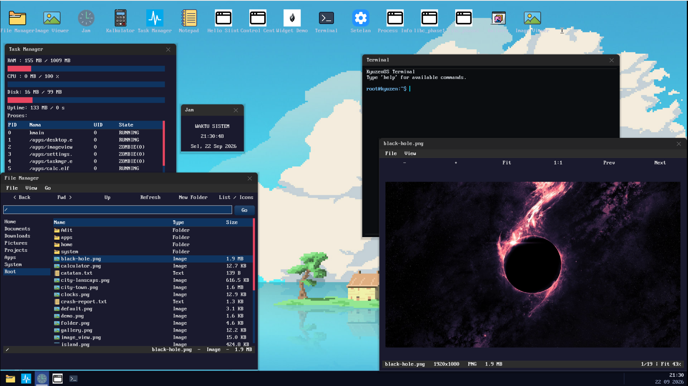

<div align="center">
  

  # Kyuzen OS

  **A 64-bit higher-half operating system built from scratch — with a real GUI, SMP, and protected userspace**

  
  
  
  
  
  
  

  
</div>

---

KyuzenOS is a monolithic operating system written from scratch in C, C++, and
Rust — no standard library, no starter code. It boots on bare metal (BIOS and
UEFI) into a higher-half 64-bit kernel with preemptive multi-core scheduling,
memory-protected Ring-3 applications, a composited window manager, its own
filesystem, and a TCP/IP stack.

Every pixel, window, and keystroke on screen is produced by code in this
repository.

## Capabilities

| Area | What KyuzenOS provides |
| --- | --- |
| **Kernel** | Higher-half monolithic kernel at `0xFFFFFFFF80000000`, Limine boot (hybrid BIOS+UEFI ISO), SMP up to 16 CPUs, preemptive scheduler with per-CPU run queues and work stealing |
| **Memory** | Bitmap physical allocator, 4-level paging, kernel heap, per-process user heap with guard pages |
| **Processes** | Unified task model: spawn, exec, fork, wait, kill; per-task credentials; zombie reaping |
| **Protection** | Ring-3 isolation for **all** user code (including `init`/`login`/`shell`), per-process address spaces, SMAP/SMEP, WP, and a validated boundary-copy layer |
| **Filesystem** | KyuzenFS V4: extent-based, 4 KB block cache, real directories, POSIX-style fd API |
| **Networking** | lwIP TCP/IP on an Intel e1000 NIC: DHCP, DNS, ICMP ping, TCP client sockets |
| **Graphics** | Graphics HAL (GHAL) with software, VirtIO-GPU, and Intel iGPU backends; dirty-region compositor; KWM window manager |
| **GUI** | Widget toolkit (`libui`), XML declarative UI, `libdesktop` C++ framework, and a desktop environment |
| **Userspace** | C SDK (LLVM libc 22), C++ SDK (libc++ subset), optional Rust (`no_std` + Slint) |
| **Apps** | File manager, terminal, notepad, clock, calculator, image viewer, task manager, settings, browser |

## Architecture at a Glance

```text
Applications (Ring 3)   —  kernel image contains no user code
    │  init (PID 1) → login → shell, desktop, zen
    │  calc · fileman · terminal · notepad · browser · …
    ▼
Frameworks & Libraries
    │  libdesktop · widget toolkit (libui) · XML UI · C/C++/Rust SDKs
    ▼
Syscall boundary  (int 0x80 + boundary copy)
    │
Kernel (Ring 0)
    │  process · scheduler · sync · VMM/PMM/heap · VFS · KWM/compositor
    ▼
Drivers
    │  ATA · PS/2 · PCI · RTC · serial · PIT/LAPIC · e1000 · VirtIO-GPU · Intel iGPU
    ▼
Hardware / Firmware  (Limine bootloader handoff)
```

Full details: [Architecture Overview](docs/architecture/overview.md).

## Repository Structure

| Directory | Contents |
| --- | --- |
| `arch/x86/` | GDT/TSS, IDT, ISR/LAPIC/SMP entry (assembly) |
| `kernel/` | Kernel core: `mm/`, `sched/`, `proc/`, `sync/`, `fs/`, `net/`, `gfx/`, `syscall/`, `panic/`, `debug/`, `smp/` |
| `drivers/` | ATA, PS/2, PCI, RTC, serial, timer, e1000 NIC, VirtIO-GPU |
| `graphics/` | Graphics HAL (GHAL) and backends |
| `system/` | System programs built as ring-3 ELFs: `init` (PID 1), `login`, `shell`, `zen`, `cat`/`echo` |
| `apps/` | Ring-3 applications and the application build |
| `libs/` | Userspace libraries: `core/`, `gui/`, `c/`, `cpp/`, `media/`, `text/` |
| `rust/` | Rust userspace crates and applications |
| `tests/` | `host/unit/` (host tests), `host/probes/` (QEMU harness), `target/` (in-OS test ELFs) |
| `manifests/` | Application manifests (`<name>.app`) |
| `third_party/` | Vendored lwIP, LLVM libc/libc++, FreeType, BearSSL |
| `tools/` | Host tools (KyuzenFS formatter, verification scripts) |
| `docs/` | This documentation |
| `limine/` | Prebuilt bootloader binaries |

## Building

### Requirements

- **Clang/LLVM** (`clang`, `ld.lld`)
- **NASM**
- **CMake** ≥ 3.20 and **Ninja**
- **xorriso** (hybrid ISO)
- **QEMU** (`qemu-system-x86_64`)
- **Python 3** (for the LLVM libc build)
- **Rust toolchain** (optional, for Rust applications)

Full platform setup (Windows/MSYS2 and Linux) is in
[Building](docs/development/building.md).

### Build and run

```sh
./build.sh            # 1. compile the kernel and libraries → build/target/bin/myos.bin
./build.sh iso        # 2. build the SDKs, apps, Rust apps, and the ISO
./build.sh run        # 3. boot in QEMU (virtio-vga 1920×1080, 8 CPUs)
```

`./build.sh` sets up the toolchain PATH for you — on MSYS2 this matters, because
the project needs tools from two different clang installations. See
[Building](docs/development/building.md#why-the-script-exists).

See [Running](docs/development/running.md) for QEMU options and first-boot
details.

### Common targets

| Target | Purpose |
| --- | --- |
| `./build.sh` | Compile the kernel, libraries, and applications |
| `./build.sh iso` | Build the bootable ISO |
| `./build.sh run` | Build and boot in QEMU |
| `./build.sh test` | Run the host-side test suite |
| `./build.sh mkfs` | Build the host-side KyuzenFS formatter |
| `./build.sh <target>` | Any Ninja target (`kyuzen-kernel`, `kyuzen-desktop`, …) |

Everything generated goes under `build/` (gitignored); nothing is written into
the source tree, so `rm -rf build` is a complete reset. See
[Testing](docs/development/testing.md) for the test suite.

## First Boot

On a fresh disk, KyuzenOS runs a one-time setup asking you to **create the root
password** (stored in `users.sys`). You then land on the login screen; logging
in drops you into the shell.

Default credentials: **root** / **1**

A quick shell tour:

```text
root@kyuzen> help            # list every command
root@kyuzen> ls              # KyuzenFS listing
root@kyuzen> start calc      # spawn a concurrent GUI application
root@kyuzen> sched           # scheduler / CPU dump
root@kyuzen> ping 8.8.8.8    # ICMP echo over lwIP
```

Typing an application name execs it in place; `start <app>` spawns it
concurrently. See [Shell & CLI](docs/userspace/shell.md).

## Documentation

The documentation index is [`docs/README.md`](docs/README.md). Key entry
points:

| Topic | Document |
| --- | --- |
| System overview and boot | [Architecture](docs/architecture/overview.md) |
| Kernel subsystems | [Kernel](docs/kernel/memory.md) |
| Filesystem | [Filesystem](docs/filesystem/README.md) |
| Networking | [Networking](docs/networking/README.md) |
| Graphics and windowing | [Graphics](docs/graphics/README.md) |
| GUI and desktop | [GUI](docs/gui/README.md) |
| Userspace and applications | [Userspace](docs/userspace/overview.md) |
| SDKs and libraries | [Libraries](docs/libraries/c-sdk.md) |
| Building, running, testing, debugging | [Development](docs/development/building.md) |
| Syscall and constants reference | [Reference](docs/reference/syscalls.md) |
| Design rationale | [Design Notes](docs/design/README.md) |
| Project history | [Development History](docs/history/README.md) |

## Contributing

Contributions are welcome. Start with the [Contributing Guide](CONTRIBUTING.md)
for the full workflow — setup, build, test, branch, commit, and pull request.

Two rule sets apply:

- [`RULES.md`](RULES.md) — commits, branches, and pull request expectations.
- [`.rules/`](.rules/RULES.md) — how to write the code: style, architecture,
  error handling, memory safety, synchronization, and documentation.

In short: never prioritize speed over quality, prefer readability, reuse
existing systems, make minimal changes, and update the documentation.

Report bugs with the [issue templates](.github/ISSUE_TEMPLATE/); report
security vulnerabilities privately per [`SECURITY.md`](SECURITY.md).

## Project Status

KyuzenOS is under active development. Documentation labels each subsystem
honestly as `Currently supported`, `Not currently implemented`, `Experimental`,
or `Planned`. Where documentation and code disagree, the code is the source of
truth.

Known incomplete areas include TCP server sockets and UDP at the socket API
level, IPv6, signals/process groups, filesystem journaling, and copy-on-write
`fork`. See each subsystem document for its limitations.

## License

Distributed under the **MIT License** — free to use, modify, and redistribute.
See [`LICENSE`](LICENSE).

<div align="center">
  <i>Built with a modern Clang toolchain (<code>-mno-red-zone</code>, <code>-mcmodel=kernel</code>, <code>-ffreestanding</code>).</i>
</div>
